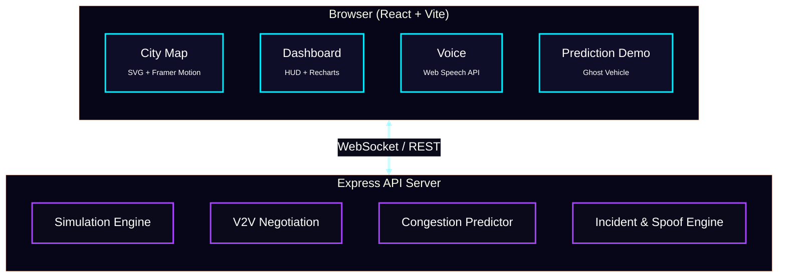

<svg xmlns="http://www.w3.org/2000/svg" width="100%" height="180" viewBox="0 0 1200 180">https://vmind-five.vercel.app/
  
  <defs>
    <linearGradient id="bg" x1="0" y1="0" x2="1" y2="1">
      <stop offset="0%" stop-color="#0a0a1a"/>
      <stop offset="50%" stop-color="#0e0e28"/>
      <stop offset="100%" stop-color="#060618"/>
    </linearGradient>
    <linearGradient id="accent" x1="0" y1="0" x2="1" y2="0">
      <stop offset="0%" stop-color="#00eeff"/>
      <stop offset="50%" stop-color="#aa44ff"/>
      <stop offset="100%" stop-color="#ff6600"/>
    </linearGradient>
    <filter id="glow">
      <feGaussianBlur stdDeviation="4" result="blur"/>
      <feMerge><feMergeNode in="blur"/><feMergeNode in="SourceGraphic"/></feMerge>
    </filter>
  </defs>
  <rect width="1200" height="180" fill="url(#bg)"/>
  <text x="600" y="60" text-anchor="middle" fill="url(#accent)" font-size="36" font-family="system-ui,sans-serif" font-weight="800" letter-spacing="6" filter="url(#glow)">AI VEHICLE ECOSYSTEM</text>
  <text x="600" y="95" text-anchor="middle" fill="#ffffff50" font-size="14" font-family="monospace" letter-spacing="4">AUTONOMOUS V2V TRAFFIC SIMULATION PLATFORM</text>
  <line x1="200" y1="110" x2="1000" y2="110" stroke="#ffffff10" stroke-width="1"/>
  <g transform="translate(0, 125)" fill="none">
    <path d="M 0,0 Q 100,-15 200,0 T 400,0 T 600,0 T 800,0 T 1000,0 T 1200,0" stroke="#00eeff20" stroke-width="1"/>
    <path d="M 0,0 Q 100,-15 200,0 T 400,0 T 600,0 T 800,0 T 1000,0 T 1200,0" stroke="#aa44ff15" stroke-width="2" stroke-dasharray="4 8"/>
  </g>
</svg>

<br/>

**AI Vehicle Ecosystem** is a real-time traffic simulation platform that models an autonomous Vehicle-to-Vehicle (V2V) communication network across a detailed SVG-rendered city. It demonstrates decentralized traffic negotiation, congestion prediction, spoofing attack detection, valet parking orchestration, and voice-narrated situational awareness -- all within a single-page dashboard powered by a WebSocket-backed simulation engine.

---

## Architecture



---

## Core Features

### Real-Time City Map
An interactive SVG city with 10+ nodes, roads, traffic lights, buildings, and landmarks -- all rendered with gradients, drop shadows, and glow effects:

- **Downtown Core** with animated 4-phase traffic signals (Green, Amber, Red)
- **Airport** with taxiing and departing aircraft
- **Harbour** with animated ship and water body
- **University, Stadium, Central Market, Riverside Grill, Parking Garage** -- each with distinct architectural styling
- **Valet Parking Station** with 4 parking spots (P1-P4) and live occupancy status

### V2V Communication Network
Vehicles negotiate right-of-way at intersections via handshake/yield/priority messages, displayed in a live feed with animated communication beams.

### TrafficProphet Prediction
Click the **+35 MIN FORECAST** badge on any vehicle to see a ghost vehicle simulate its route, detect a Downtown bottleneck, and dynamically reroute -- saving an estimated **12 minutes**.

### Valet Parking Orchestration
A client-side synthetic valet vehicle navigates the road network from Industrial Zone to Upper East parking, demonstrating:

- Time-based waypoint traversal (28-second cycle)
- Traffic-aware speed adjustment (slows when nearby vehicles detected)
- Automatic return trip with reverse waypoints
- P4 parking slot booking, engagement, and release

### Voice Narration
Web Speech API integration delivers spoken alerts for spoofing attacks, incidents, reroutes, low-fuel warnings, and parking events -- with configurable urgency levels.

### Security Simulation
- **Spoofing Attacks**: Malicious vehicles broadcast false priority scores; V2V network detects and blacklists them
- **Incident Zones**: Road closures trigger rerouting; affected edges flash red with pulsing alerts

---

## Tech Stack

| Layer | Technology |
|---|---|
| **Frontend** | React 19, TypeScript, Vite, Framer Motion, Tailwind CSS |
| **Backend** | Express.js, WebSocket (ws), TypeScript |
| **Charts** | Recharts |
| **UI Primitives** | Radix UI (30+ components), Lucide Icons |
| **State** | React Query, custom WebSocket hook |
| **Package Manager** | pnpm (workspace monorepo) |
| **Build** | Vite, tsc |

---

## Getting Started

```bash
# Clone the monorepo
git clone https://github.com/jacksonvincent012-web/ai-vehicle-ecosystem.git
cd ai-vehicle-ecosystem

# Install dependencies
pnpm install

# Start the API server (port 3001)
pnpm --filter api-server dev

# In another terminal, start the frontend (port 5173)
pnpm --filter vmind dev
```

Open `http://localhost:5173` to enter the command center.

---

## Project Structure

```
artifacts/
├── api-server/          # Express + WebSocket simulation backend
│   ├── src/
│   │   ├── index.ts         # Server entry, WebSocket handler
│   │   └── simulation.ts    # Core simulation engine
│   └── package.json
│
└── vmind/               # React frontend
    ├── src/
    │   ├── components/
    │   │   ├── CityMap.tsx          # Full SVG city renderer
    │   │   ├── PredictionDemo.tsx   # Ghost vehicle forecast
    │   │   ├── panels/              # Dashboard widgets
    │   │   └── ui/                  # Radix UI primitives
    │   ├── hooks/
    │   │   ├── use-vmind-state.ts   # Central state + valet injection
    │   │   └── use-voice-narration.ts
    │   ├── pages/
    │   │   └── Dashboard.tsx        # Main HUD layout
    │   └── lib/utils.ts
    └── package.json
```

---

## Deployment

### Vercel (Frontend)

```bash
# Install Vercel CLI
pnpm add -g vercel

# Deploy from the vmind directory
cd artifacts/vmind
vercel deploy --prod
```

### Docker (API Server)

```bash
cd artifacts/api-server
docker build -t vmind-api .
docker run -p 3001:3001 vmind-api
```

---

## Roadmap

- [x] City map with 10+ nodes and landmarks
- [x] V2V negotiation with animated communication beams
- [x] Congestion prediction demo with ghost vehicle
- [x] Security attack simulation (spoofing + incident)
- [x] Valet parking orchestration
- [x] Voice narration for events
- [x] SVG gradients, shadows, 3D effects for realism

- [ ] **60fps smooth vehicle animation** (requestAnimationFrame interpolation)
- [ ] **Data-driven route prediction** (use real congestion data)
- [ ] **Rain / fog environmental effects**
- [ ] **React performance optimization** (memoization, virtual list)
- [ ] **Dynamic valet routing** via pathfinding
- [ ] **Click-to-follow vehicle camera**
- [ ] **Live statistics HUD** (avg speed, ETA, fleet metrics)
- [ ] **Light / dark mode with automatic day/night cycle**

---

## License

MIT -- feel free to build on this.

<p align="center">
  <sub>Built with TypeScript, React, and an unhealthy obsession with traffic flow.</sub>
</p>
