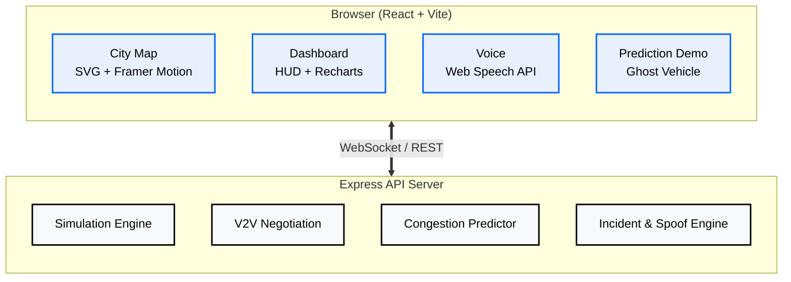

<p align="center">
  <svg xmlns="http://www.w3.org/2000/svg" width="800" height="200" viewBox="0 0 800 200">
    <defs>
      <linearGradient id="bgBanner" x1="0" y1="0" x2="0" y2="1">
        <stop offset="0%" stop-color="#000000"/>
        <stop offset="100%" stop-color="#0a1628"/>
      </linearGradient>
      <linearGradient id="lineGlow" x1="0" y1="0" x2="1" y2="0">
        <stop offset="0%" stop-color="#0066ff00"/>
        <stop offset="30%" stop-color="#0066ff40"/>
        <stop offset="50%" stop-color="#ffffff60"/>
        <stop offset="70%" stop-color="#0066ff40"/>
        <stop offset="100%" stop-color="#0066ff00"/>
      </linearGradient>
    </defs>
    <rect width="800" height="200" fill="url(#bgBanner)" rx="8"/>
    <rect x="1" y="1" width="798" height="198" fill="none" stroke="#0066ff20" stroke-width="1" rx="8"/>
    <text x="400" y="75" text-anchor="middle" fill="#ffffff" font-size="32" font-family="system-ui,-apple-system,sans-serif" font-weight="700" letter-spacing="4">AI VEHICLE ECOSYSTEM</text>
    <text x="400" y="105" text-anchor="middle" fill="#8899bb" font-size="13" font-family="system-ui,-apple-system,sans-serif" font-weight="400" letter-spacing="6">AUTONOMOUS V2V TRAFFIC SIMULATION PLATFORM</text>
    <line x1="200" y1="125" x2="600" y2="125" stroke="url(#lineGlow)" stroke-width="1"/>
    <g transform="translate(0, 145)">
      <rect x="340" y="0" width="120" height="30" rx="4" fill="#0066ff15" stroke="#0066ff30" stroke-width="1"/>
      <text x="400" y="20" text-anchor="middle" fill="#4488ff" font-size="11" font-family="system-ui,sans-serif" font-weight="500" letter-spacing="2">REACT + EXPRESS</text>
    </g>
  </svg>
</p>

<br/>

**Live demo:** [https://vmind-five.vercel.app](https://vmind-five.vercel.app)

**AI Vehicle Ecosystem** is a real-time traffic simulation platform that models an autonomous Vehicle-to-Vehicle (V2V) communication network across a detailed SVG-rendered city. It demonstrates decentralized traffic negotiation, congestion prediction, spoofing attack detection, valet parking orchestration, and voice-narrated situational awareness -- all within a single-page dashboard powered by a WebSocket-backed simulation engine.

---

## Architecture



---

## Features

### Real-Time City Map
An interactive SVG city with 10+ nodes, roads, traffic lights, buildings, and landmarks:

- Downtown Core with animated 4-phase traffic signals (Green, Amber, Red)
- Airport with taxiing and departing aircraft
- Harbour with animated ship and water body
- University, Stadium, Central Market, Riverside Grill, Parking Garage -- each with distinct styling
- Valet Parking Station with 4 parking spots (P1-P4) and live occupancy status

### V2V Communication Network
Vehicles negotiate right-of-way at intersections via handshake/yield/priority messages, displayed in a live feed with animated communication beams.

### TrafficProphet Prediction
Click the **+35 MIN FORECAST** badge on any vehicle to see a ghost vehicle simulate its route, detect a Downtown bottleneck, and dynamically reroute -- saving an estimated **12 minutes**.

### Valet Parking Orchestration
A client-side synthetic valet vehicle navigates the road network from Industrial Zone to Upper East parking:

- Time-based waypoint traversal (28-second cycle)
- Traffic-aware speed adjustment (slows when nearby vehicles detected)
- Automatic return trip with reverse waypoints
- P4 parking slot booking, engagement, and release

### Voice Narration
Web Speech API integration delivers spoken alerts for spoofing attacks, incidents, reroutes, low-fuel warnings, and parking events.

### Security Simulation
- **Spoofing Attacks**: Malicious vehicles broadcast false priority scores; V2V network detects and blacklists them
- **Incident Zones**: Road closures trigger rerouting; affected edges flash red with pulsing alerts

---

## Tech Stack

| Layer | Technology |
|---|---|
| **Frontend** | React 19, TypeScript, Vite, Framer Motion, Tailwind CSS |
| **Backend** | Express.js, WebSocket (ws), TypeScript |
| **Charts** | Recharts |
| **UI Primitives** | Radix UI (30+ components), Lucide Icons |
| **State** | React Query, custom WebSocket hook |
| **Package Manager** | pnpm (workspace monorepo) |
| **Build** | Vite, tsc |

---

## Quick Start

```bash
pnpm install
pnpm --filter api-server dev   # terminal 1: API on :3001
pnpm --filter vmind dev        # terminal 2: UI on :5173
```


---

## Project Structure

```
artifacts/
├── api-server/          Express + WebSocket simulation backend
│   ├── src/
│   │   ├── index.ts         Server entry, WebSocket handler
│   │   └── simulation.ts    Core simulation engine
│   └── package.json
│
└── vmind/               React frontend
    ├── src/
    │   ├── components/
    │   │   ├── CityMap.tsx          Full SVG city renderer
    │   │   ├── PredictionDemo.tsx   Ghost vehicle forecast
    │   │   ├── panels/              Dashboard widgets
    │   │   └── ui/                  Radix UI primitives
    │   ├── hooks/
    │   │   ├── use-vmind-state.ts   Central state + valet injection
    │   │   └── use-voice-narration.ts
    │   ├── pages/
    │   │   └── Dashboard.tsx        Main HUD layout
    │   └── lib/utils.ts
    └── package.json
```

---

## Deployment

### Vercel (Frontend)

```bash
pnpm add -g vercel
cd artifacts/vmind
vercel deploy --prod
```

### Docker (API Server)

```bash
cd artifacts/api-server
docker build -t vmind-api .
docker run -p 3001:3001 vmind-api
```

---

## Roadmap

- [x] City map with 10+ nodes and landmarks
- [x] V2V negotiation with animated communication beams
- [x] Congestion prediction demo with ghost vehicle
- [x] Security attack simulation (spoofing + incident)
- [x] Valet parking orchestration
- [x] Voice narration for events
- [x] SVG gradients, shadows, 3D effects for realism
- [ ] 60fps smooth vehicle animation (requestAnimationFrame interpolation)
- [ ] Data-driven route prediction (use real congestion data)
- [ ] Rain / fog environmental effects
- [ ] React performance optimization (memoization, virtual list)
- [ ] Dynamic valet routing via pathfinding
- [ ] Click-to-follow vehicle camera
- [ ] Live statistics HUD (avg speed, ETA, fleet metrics)
- [ ] Light / dark mode with automatic day/night cycle

---

---

## License

Licensed under the Apache License, Version 2.0 (the "License");
you may not use this file except in compliance with the License.
You may obtain a copy of the License at

    http://www.apache.org/licenses/LICENSE-2.0

Unless required by applicable law or agreed to in writing, software
distributed under the License is distributed on an "AS IS" BASIS,
WITHOUT WARRANTIES OR CONDITIONS OF ANY KIND, either express or implied.
See the License for the specific language governing permissions and
limitations under the License.

---

<p align="center">
  Copyright &copy; 2026 JacksonVincent. All rights reserved.
</p>
